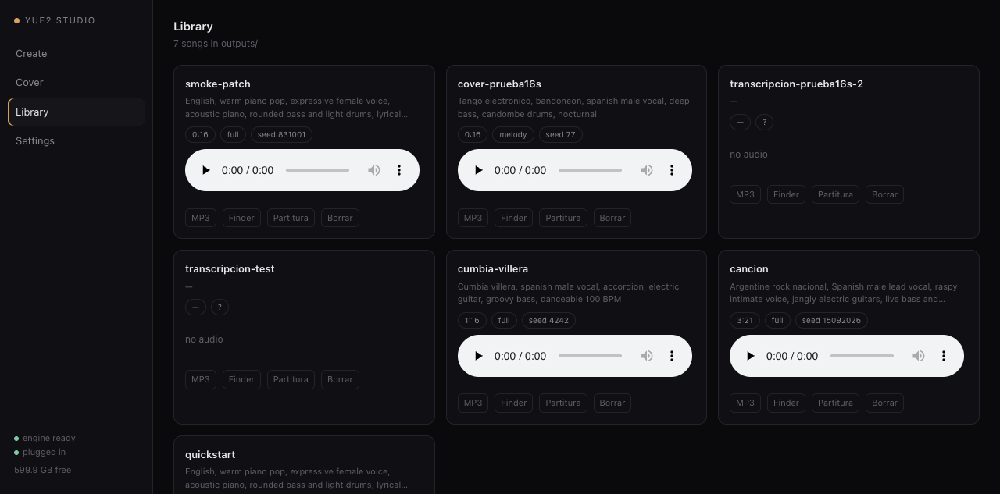

# YuE2 Studio

App nativa de macOS (más un instalador de un comando) para correr **YuE2-3B** — el modelo
abierto de música con planificación simbólica — **localmente en Apple Silicon**, con los
arreglos necesarios para que funcione en una Mac de 24 GB.

Generación, covers y transcripción corren enteros en la GPU vía MLX, sin CUDA, sin nube y
sin PyTorch en runtime.



## Qué trae

- **App de escritorio** (`YuE2 Studio.app`): crear canciones, hacer covers de cualquier
  grabación, biblioteca de todo lo generado con player y export a MP3.
- **Instalador** (`install.sh`): clona el port MLX, aplica los parches, baja los pesos,
  verifica el runtime y compila la app. Re-ejecutable e idempotente.
- **Dos parches** para máquinas de 24 GB (ver [docs/PATCHES.md](docs/PATCHES.md)): el guard de
  memoria de upstream aborta ante un aviso transitorio de macOS, y el helper de transcripción
  trae un presupuesto de memoria que una Mac de 24 GB nunca puede satisfacer.

## Requisitos

| | |
|---|---|
| Máquina | Apple Silicon (M1–M5); Intel/Rosetta queda rechazado |
| macOS | 14.2+ (M1–M4) · 26.2+ en M5 |
| Memoria | 24 GB unificada mínimo; 32 GB+ holgado |
| Disco | ~14 GB (11 GB de pesos + 2.6 GB de transcripción opcional) |
| Herramientas | `uv`, `ffmpeg`, Xcode Command Line Tools para la app |

Medido en MacBook Pro M5 Pro / 24 GB / macOS 27:

| Trabajo | Audio | Tiempo | Pico de memoria |
|---|---|---|---|
| Clip quickstart (32 pasos) | 16 s | 13 s | ~7 GiB |
| Canción de 3:20 (32 pasos) | 200.7 s | 337 s (RTF 1.68) | 10.4 GiB |
| Canción de 1:16 (8 pasos) | 76 s | 47 s (RTF 0.62) | ~9 GiB |
| Transcripción de 16 s | — | 5.7 s | ~5 GiB |

## Instalar

```bash
git clone https://github.com/stavitian/yue2-studio.git
cd yue2-studio
bash install.sh                    # + --with-transcribe para covers (+2.6 GB)
open "$HOME/Applications/YuE2 Studio.app"
```

Sin app nativa, la interfaz es la misma en el navegador:

```bash
python3 server.py                  # http://127.0.0.1:8787
```

Estado de una instalación: `bash install.sh --check`. Paso a paso manual:
[docs/INSTALL.md](docs/INSTALL.md).

## Documentación

| | |
|---|---|
| [docs/INSTALL.md](docs/INSTALL.md) | instalación manual, desinstalación, estructura en disco |
| [docs/HARDWARE.md](docs/HARDWARE.md) | hardware, tiempos reales, el guard de memoria |
| [docs/PATCHES.md](docs/PATCHES.md) | los dos parches: qué cambian, evidencia, cómo revertir |
| [docs/TROUBLESHOOTING.md](docs/TROUBLESHOOTING.md) | todos los errores vistos y su arreglo |
| [docs/USAGE.md](docs/USAGE.md) | flujos, prompts, modos, pasos, semillas, recetas |
| [docs/MODELS.md](docs/MODELS.md) | qué se descarga, tamaños, licencias |
| [docs/CREDITS.md](docs/CREDITS.md) | créditos y licencias de terceros |

## Licencias y límites

- Este repo (instalador, backend, UI, app, parches): **MIT**.
- `mlx-Yue` es **Apache-2.0**, de [vanch007](https://github.com/vanch007/mlx-Yue).
- Los pesos de YuE2 son **CC-BY-NC-4.0**: uso personal o de investigación, **no comercial**.
  El audio que generes hereda esa restricción.
- El modelo lo entrenó el equipo Multimodal Art Projection (M-A-P) con Tokenwave.AI y MBZUAI.

El port es joven y las máquinas de 24 GB están en el borde de lo que sus autores probaron.
El instalador y los dos parches existen justamente para que una Mac de 24 GB pueda terminar
una canción. Con 32 GB o más podés usar upstream sin tocar nada.

---

English version: [README.md](README.md)
