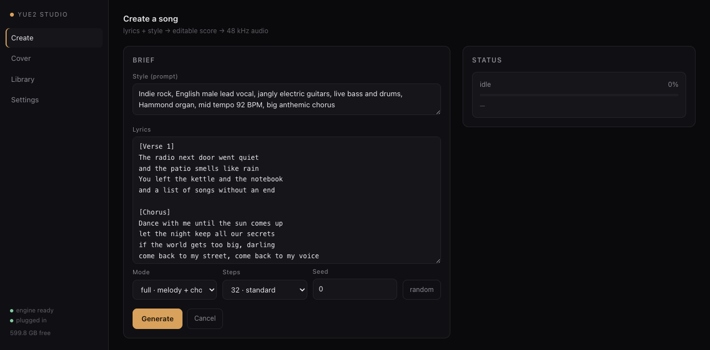

# YuE2 Studio

A native macOS app (plus a one-command installer) to run **YuE2-3B** — the open music
foundation model with symbolic planning — **locally on Apple Silicon**, with the fixes needed
to make it work on a 24 GB Mac.

Generation, covers and transcription run entirely offline on the GPU through the MLX port.
No CUDA, no cloud, no PyTorch at runtime.



---

## What you get

- **Desktop app** (`YuE2 Studio.app`): create songs, make covers from any recording, browse a
  library of everything you generated, listen, export MP3.
- **Installer** (`install.sh`): clones the MLX port, applies the patches, downloads the
  weights, verifies the runtime and builds the app. Re-runnable and idempotent.
- **Two patches** for machines with 24 GB of unified memory (see
  [docs/PATCHES.md](docs/PATCHES.md)): the upstream resource guard aborts on a transient
  macOS memory-pressure warning, and the transcription helper ships a default memory budget
  that a 24 GB Mac can never satisfy.

## Requirements

| | |
|---|---|
| Machine | Apple Silicon (M1–M5). Intel/Rosetta is rejected by the runtime |
| macOS | 14.2+ (M1–M4) · 26.2+ for M5 |
| Memory | 24 GB unified minimum — 32 GB+ is comfortable (upstream tests on 32 GB and 128 GB) |
| Disk | ~14 GB (11 GB of weights + 2.6 GB of transcription models + virtualenv) |
| Tools | [uv](https://docs.astral.sh/uv/), `ffmpeg`, Xcode command line tools (for the app) |

Measured on a MacBook Pro M5 Pro / 24 GB / macOS 27:

| Job | Audio | Wall clock | Peak memory |
|---|---|---|---|
| Quickstart clip (32 steps) | 16 s | 13 s | ~7 GiB |
| Full song, 3:20 (32 steps) | 200.7 s | 337 s (RTF 1.68) | 10.4 GiB |
| Full song, 1:16 (8 steps) | 76 s | 47 s (RTF 0.62) | ~9 GiB |
| Transcription, 16 s source | — | 5.7 s | ~5 GiB |

## Install

```bash
git clone https://github.com/stavitian/yue2-studio.git
cd yue2-studio
bash install.sh                 # add --with-transcribe for covers (+2.6 GB)
```

The installer checks your hardware, clones `mlx-Yue` into `~/Projects/mlx-Yue`, applies the
patches, downloads ~10.5 GB of weights, runs the runtime doctor and builds the app into
`~/Applications`. Then:

```bash
open "$HOME/Applications/YuE2 Studio.app"
```

No native app? Run the backend and open the browser UI:

```bash
python3 server.py        # http://127.0.0.1:8787
```

Check the state of an install at any time:

```bash
bash install.sh --check
```

Full manual path, step by step: [docs/INSTALL.md](docs/INSTALL.md).

## Use

**Create.** Write a style prompt and lyrics (section tags like `[Verse]` / `[Chorus]` work),
pick a mode (`full` = melody + chords, `melody`, `off`), pick steps (32 = standard, 8 = fast),
hit Generate. You get a 48 kHz stereo FLAC, an editable ABC score and the plan.

**Cover.** Drop in any recording; it is transcribed with SheetSage2 + MERT2 into a melody
line, you write the new style and lyrics, and YuE2 re-synthesizes it. Covers need
`--with-transcribe`.

**Library.** Everything under `<project>/outputs/` with players, MP3 export, Finder reveal and
the score viewer.

Same thing from the CLI:

```bash
cd ~/Projects/mlx-Yue
export MLX_ENABLE_TF32=0 LYRA_VAE="$PWD/models/vae"
./.venv/bin/mlx-yue generate ~/Projects/yue2-studio/examples/english-song.json \
    --model models/converted --vae "$LYRA_VAE" --precision 8bit --offline \
    --vae-core-frames 128 --memory-budget-gib 16 --output outputs/my-song
```

More workflows and prompt tips: [docs/USAGE.md](docs/USAGE.md).

## How it is put together

```
YuE2 Studio.app  (Swift · WKWebView, app/main.swift)
        │  starts and supervises
        ▼
server.py        (stdlib HTTP on 127.0.0.1:8787, one GPU job at a time, job queue,
        │         progress parsing, Range-capable audio serving, library, MP3 export)
        ▼
mlx-Yue CLI      (PyTorch-free MLX runtime: AR planner + NAR flow matching + FP32 VAE)
        ▼
Apple GPU (Metal)
```

```
.
├── install.sh                 full installer
├── build_app.sh               builds YuE2 Studio.app
├── server.py                  local backend
├── ui/index.html              interface (Create / Cover / Library / Settings)
├── app/main.swift             native window
├── patches/apply_patches.py   idempotent, reversible patches for the port
├── examples/english-song.json request example used throughout the docs
├── assets/icon.html          icon source (rendered with a headless browser)
├── assets/icon.icns          app icon, wired in by build_app.sh
├── config.example.json        backend configuration
└── docs/                      install, hardware, patches, troubleshooting, usage, models
```

## Documentation

| | |
|---|---|
| [docs/QUICKSTART.md](docs/QUICKSTART.md) | five minutes from install to a finished song |
| [docs/INSTALL.md](docs/INSTALL.md) | manual step-by-step installation, uninstall, disk layout |
| [docs/HARDWARE.md](docs/HARDWARE.md) | required hardware, measured timings, the memory guard |
| [docs/PATCHES.md](docs/PATCHES.md) | the two patches: what they change, why, how to revert |
| [docs/TROUBLESHOOTING.md](docs/TROUBLESHOOTING.md) | every error seen so far and its fix |
| [docs/USAGE.md](docs/USAGE.md) | workflows, prompts, modes, steps, seeds |
| [docs/MODELS.md](docs/MODELS.md) | what gets downloaded, sizes, licenses |
| [docs/CREDITS.md](docs/CREDITS.md) | third-party projects and licenses |

## Licenses and limits

- This repository (installer, backend, UI, app, patches): **MIT**.
- `mlx-Yue` (the MLX port) is **Apache-2.0**, by [vanch007](https://github.com/vanch007/mlx-Yue).
- YuE2 models and weights are **CC-BY-NC-4.0**: research and personal use, **not commercial**.
  The generated audio inherits that restriction.
- Trained by the Multimodal Art Projection (M-A-P) team with Tokenwave.AI and MBZUAI.

The port is young and this machine class is at the edge of what it was tested on. The
installer and the two patches exist so that a 24 GB Mac can actually finish a song; with 32 GB
or more you can run upstream unpatched.
